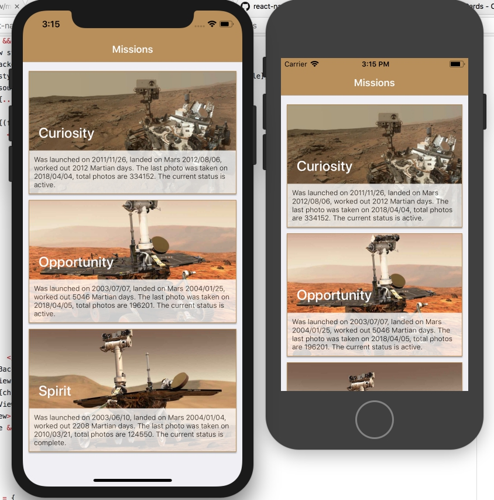

# Mars online

Hello? This is ground control. Do you read me?

Humanity can’t stop dreaming about exploring endless space and colonizing new planets, but while we’re waiting for manned flights to Mars let’s build a cool app. Our app’s goal is to romanticize Mars by letting people know how beautiful it is. Thankfully, NASA has 3 rovers that provide us with imaginary from Mars.

Work in progress! Stay tuned!

## View app with Expo client

1. Install the *Expo client* on you device from *App Store* or *Play Market*
2. Open this url:  https://expo.io/@vladimir_vovk/mars-online
3. Scan QR code or send yourself a link

## Run app on your local machine

1. Install the *Expo XDE* from https://expo.io
2. Clone this repo
3. Open project with the *Expo XDE*
4. Run app with your Device or Emulator/Simulator
